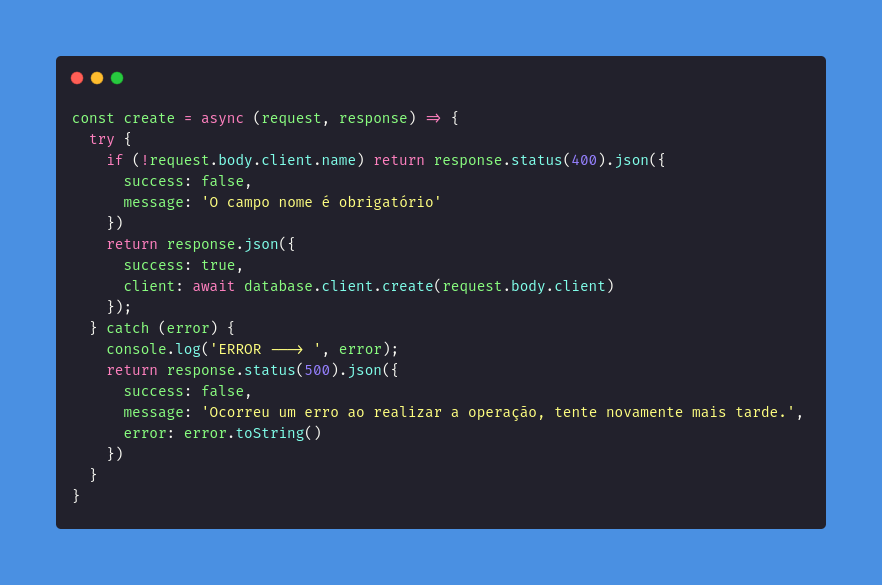
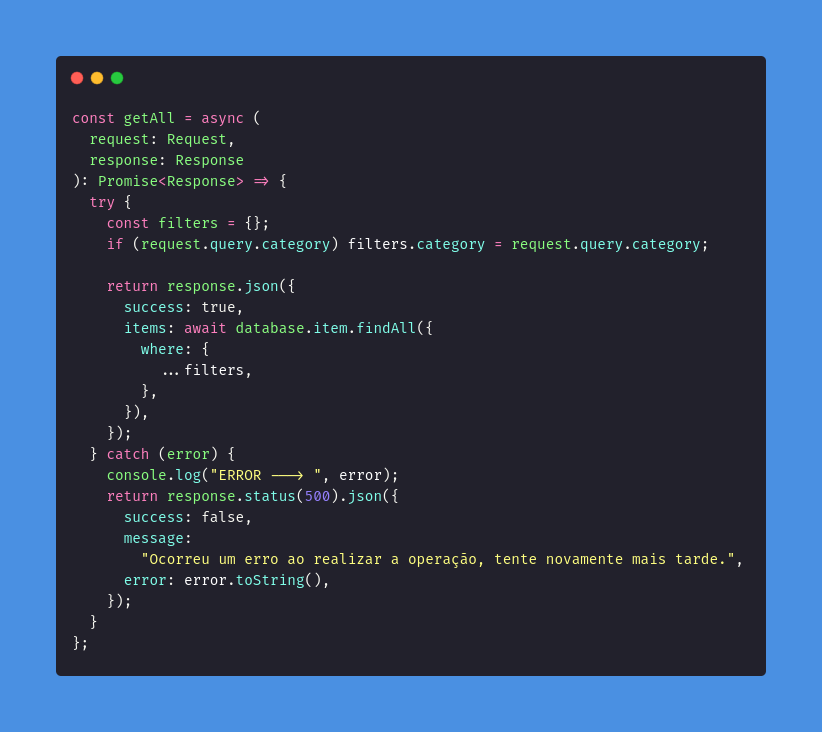
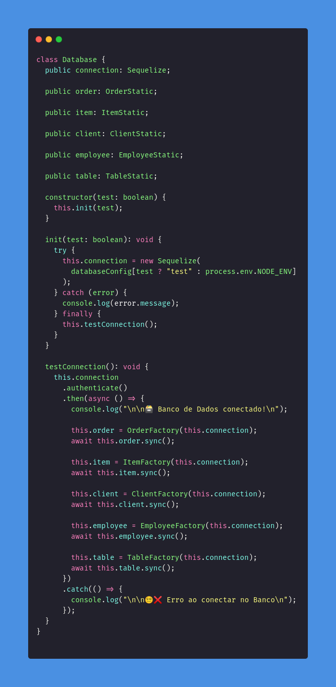

# Padrões de Projeto GRASP Adotados no Projeto
## 1. Introdução
O processo de desenvolvimento de software é composto por uma série de tarefas complexas que visam um produto final, utilizável, e que satisfaça as necessidades do cliente. Embora seja comum haver especificidades que diferem os projetos, com o passar do tempo foram estabelecidos padrões de projeto que viabilizam um design mais flexível, coeso, de fácil manutenção e permitem a reutilização do software. 

No intuito de estruturar melhor projetos desenvolvidos utilizando programação orientadaa objetos (especificamente), foi construido um padrão de projeto composto por diretrizes encarregadas de atribuir responsabilidade à classes e objetos. Esse padrão de projeto, denominado GRASP (General Responsability Assignment Software Patterns), visa realizar essa atribuição de forma que o contexto de utilização de cada uma das classes e objetos seja adaptado de acordo com suas obrigações na resolução do problema. Para isso, são utilizados dez princípios: 

## 2. Princípios e Padrões 
## 2.1. Criador
### 2.1.1. Definição
O padrão Criador tem como objetivo determinar qual classe deve ser a responsável pela criação de instâncias de determinados objetos.

Por exemplo, se for decidido que as instâncias de uma classe A devem ser criadas por uma
classe B, é importante observar os pontos a seguir:

- B “contém” A ou é uma composição de A.
- B registra A.
- B usa A de maneira muito próxima.
- B tem dados iniciais de A, os quais serão passados para A quando este for criado. B é um “especialista” em relação à criação de A.

### 2.1.2. Uso no Projeto

**Justificativa**: Viabiliza o reaproveitamento de código.

Nos códigos exemplos, temos parte da controller Client e parte da controller Item,
respectivamente, onde são responsáveis pela criação dos usuários e dos itens que serão
listados na aplicação.

<figcaption>Figura 1. Exemplo do padrão GRASP de Criador</figcaption>

<figcaption>Figura 2. Exemplo do padrão GRASP de Criador</figcaption>

## 2.2. Especialista
### 2.2.1. Definição
O princípio de especialista na informação é utilizado para atribuir responsabilidades. Consiste em delegar a responsabilidade à quem possui as informações necessárias para cumpri-la. Para isso primeiro é identificado qual seria a informação e em seguida onde ela foi armazenada, viabilizando assim o acesso da informação e, consequentemente, a atribuição.

### 2.2.2. Uso no projeto
**Justificativa**: Evita a criação de soluções desnecessariamente complexas e estimula a análise de qual seria mais objetiva.

## 2.3. Controlador

### 2.3.1. Definição
O padrão Controlador atribui a responsabilidade de receber ou lidar com um evento do sistema para uma classe que representa todo o sistema, um subsistema e um cenário de casos de uso.

Um caso de uso controlador deve ser usado para lidar com todos os eventos de casos de uso e pode ser usado para mais de um caso de uso, por exemplo, para casos de uso como Criar usuário e Excluir usuário, pode ter um único UserController, em vez de dois controllers de casos de uso separados.

É definido como o primeiro objeto além da camada de interface do usuário que recebe e coordena operações do sistema. O controlador deve delegar o trabalho que precisa ser feito para outros objetos. Ele coordena ou controla a atividade e não deve fazer muito trabalho por si próprio. O padrão Controlador pode ser considerado uma parte da camada de aplicação/serviço.

### 2.3.2. Uso no projeto

**Justificativa**: Vai ser utilizado para conectar os componentes do frontend às models do backend, delegando trabalho para os elementos responsáveis. Também é utilizado no backend para delegar as funções responsáveis por cada rota da aplicação, segue um exemplo abaixo.

No código exemplo, temos um método de uma controller responsável por lidar com a listagem de Itens da aplicação. Nela temos toda a lógica da rota, e nela que obtemos o resultado final a ser enviado para o usuário.

<figcaption>Figura 3. Exemplo do padrão GRASP de Controlador</figcaption>

## 2.4. Alta Coesão
### 2.4.1. Definição

Mantém a complexidade controlada através da restrição de atividades que cada elemento é responsável por realizar. A alta coesão é mantida, por exemplo, quando cada classe é fortemente focada e realiza apenas funções relacionadas, sem muitas distinções.

### 2.4.2. Uso no projeto
**Justificativa**: Evita o compormetimento de grande parte do funcionamento da aplicação pois isola o funcionamento de cada coisa, além de permitir alterações mais específicas caso necessário.

## 2.5. Baixo Acoplamento

## 2.5.1. Definição
O padrão de projeto GRASP tem como objetivo resolver o problema de alta dependência, que resulta em alto impacto de mudança, dificultando sua manutenção, e baixa reutilização. Antes de explicar um pouco mais sobre o padrão, acho importante relembrar o significado de acoplamento.

Acoplamento: uma medida de quão fortemente um elemento é conectado, tem conhecimento de, ou depende de outros. Um elemento com baixo acoplamento não é dependente de muitos outros elementos.

Para isso, é proposto atribuir as responsabilidades de modo que o acoplamento entre classes permaneça baixo. Mesmo propondo o baixo acoplamento, não é recomendado um nível extremo dessa medida, quando não há nenhuma relação entre classes. Importante ressaltar também de que subclasses são fortemente acopladas à sua superclasse.

### 2.5.2. Uso no projeto

**Justificativa**: Assim como a alta coesão, possui papel importante na diminuição da dependência entre as pequenas partes que compoem o sistema e também facilita o reaproveitamento de código, melhorando assim a qualidade do produto.

No código abaixo, damos um exemplo de onde utilizamos este padrão de projeto. Note que a classe Database tem um único propósito de se comunicar com o banco de dados, mesmo sendo utilizada em outros trechos da API ela não tem acoplamento com outras classes e realiza o seu trabalho independentemente de fatores externos.

<figcaption>Figura 4. Exemplo do padrão GRASP de Baixo Acoplamento</figcaption>

## 2.6. Variações Protegidas 
### 2.6.1. Definição

O princípio de variações protegidas é responsável por assegurar que o projeto e seus objetos, subsistemas e demais componentes possam ser alterados ou sofrer instabilidades sem que haja impactos indesejáveis nos demais elementos do sistema. Para isso, interfaces são criadas em volta desses pontos potenciais de variação, motivando também a utilização de encapsulamento, polimorfismo e indireção.

### 2.6.2. Uso no projeto
**Justificativa**: Favorece o desenvolvimento de um sistema mais estável, onde parte pode entrar em inatividade sem comprometer integralmente o funcionamento das demais.

## 2.7. Invenção Pura
### 2.7.1. Definição

O padrão de Invenção Pura resolve o problema de uma responsabilidade que deve ser alocada a um objeto, mas irá atrapalhar a coesão e/ou o acoplamento daquele objeto. Para solucionar esse problema, é proposto atribuir um conjunto de responsabilidades altamente coeso a uma classe artificial ou de conveniência e que não represente um conceito do domínio do problema. Em alguns casos essas classes artificiais são tratados e nomeados como "serviços" na aplicação, o que define melhor o objetivo daquele elemento, de realizar um serviço em específico que não está diretamente conectado ao domínio.

### 2.7.2. Uso no projeto
**Justificativa**: aumento da coesão à medida em que a nova classe agrega funcionalidades
altamente correlatas e da capacidade de reutilização decorrente de classes de Invenção Pura
que agrupam comportamentos muito utilizados.

## 3. Referências
> - SERRANO, Milene. Aula - GRASP - PARTE I
> - SERRANO, Milene. Slide Arquitetura e Desenho de Software AULA - GRASP_B - COMPLEMENTAR. Disponível [aqui](https://aprender3.unb.br/pluginfile.php/897140/mod_label/intro/Arquitetura%20e%20Desenho%20de%20Software%20-%20Aula%20GRASP_B%20-%20Profa.%20Milene%20-%20Complementar.pdf). Acesso em 28 de agosto de 2021.
> - DEVMEDIA, Desenvolvimento com qualidade com GRASP Disponível [aqui](]https://www.devmedia.com.br/desenvolvimento-com-qualidade-com-grasp/28704). Acesso em 26 de agosto de 2021.
> - Slide Padrões de Projeto - Bruna Diirr. Disponível [aqui](http://www.ic.uff.br/~anselmo/cursos/ProjSoft/apresentacoes/Padroes%20de%20projeto.pdf). Acesso em 28 de agosto de 2021.
> - Slide Padrões GRASP. Disponível [aqui](http://www.facom.ufu.br/~bacala/ESOF/05a-Padr%C3%B5es%20GRASP.pdf). Acesso em 28 de agosto de 2021.
> - Slide GRASP: Designing - Objetos com Responsabilidades. Disponível [aqui](https://www.ic.unicamp.br/~ariadne/mc436/1s2017/Lar16GRASP.pdf). Acesso em 28 de agosto de 2021.
> - Inversão de Controle (IoC) e Injeção de Dependência (DI) - Diferenças. Disponível [aqui](http://www.linhadecodigo.com.br/artigo/3418/inversao-de-controle-ioc-e-injecao-de-dependencia-di-diferencas.aspx#:~:text=Invers%C3%A3o%20de%20Controle%20ou%20Inversion,outra%20classe%2C%20interface%2C%20componente%2C). Acesso em 28 de agosto de 2021.

## Histórico de Revisões
|    Data    | Versão | Descrição       | Autor(es)     |
| :--------- | :----- | :-------------- | :------------ |
| 26/08/2021 | 1.0    | Criação do documento e desenvolvimento de tópicos | [Brenda Santos](https://github.com/brendavsantos) |
| 28/08/2021 | 1.2    | Desenvolvimento dos padrões Baixo Acoplamento, Controlador e Inversão de Controle | [Tiago Samuel](https://github.com/tsrrodrigues) |
| 29/08/2021 | 1.3    | Desenvolvimento dos padrões Polimorfismo, Indireção e Criador e padronização tópico referências | [Eduarda Servidio](https://github.com/ServideoEC) |
| 03/09/2021 | 1.4    | Adição das justificativas de uso | [Brenda Santos](https://github.com/brendavsantos) |
| 03/09/2021 | 1.5    | Revisão do documento | [Sergio Cipriano](https://github.com/sergiosacj), [Emily Dias](https://github.com/emysdias) |
| 19/09/2021 | 1.6    | Adição de códigos referentes aos padrões | [Eduarda Servidio](https://github.com/ServideoEC) e  [Tiago Samuel](https://github.com/tsrrodrigues)|
| 20/09/2021 | 2.0    | Adição de imagens e revisão do documento | [Lucas Boaventura](https://github.com/lboaventura25) |
