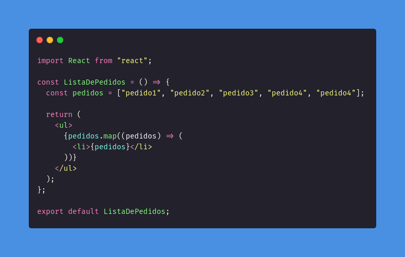

# Padrões de Projeto GoFs Comportamentais Adotados no Projeto

## 1. Introdução

Algo que na maioria das vezes os projetistas avançados fazem é resolver problemas que reutilizam soluções que funcionaram no passado e os usam repetidamente em outros projetos, por isso que os padrões de projetos e design patterns têm chamado a atenção e despertado o interesse dos projetistas de software, por proporcionar elementos que conduzem ao reaproveitamento de soluções e não apenas a reutilização de código.

Os padrões acabam facilitando reutilizar arquiteturas bem sucedidas para construir softwares de forma mais flexível e fácil de manter. O uso de padrões de projeto pode reduzir a complexidade do processo de projetar software.

Neste arquivo será tratado sobre os padrões de projetos GoFs Comportamentais, onde atuam sobre como responsabilidades são atribuídas as entidades, ou seja, qual o comportamento das entidades. Estes padrões facilitam a comunicação entre os objetos, distribuindo as responsabilidades e definindo a comunicação interna.

## 2. Princípios e Padrões

## 2.1. Command

É um padrão de projeto comportamental que transforma um pedido em um objeto independente que contém toda a informação sobre o pedido. Essa transformação permite que você parametrize métodos com diferentes pedidos, atrase ou coloque a execução do pedido em uma fila e suporte operações que não podem ser feitas.

**Justificativa**: Será utilizado, pois no aplicativo haverá requisições que serão feitas para a API por meio de uma componente/classe específica que possui métodos que irão lidar com cada tipo de requisição (comando).

## 2.2. Template Method

O Padrão de Projeto Template Method define os passos de um algoritmo e permite que a implementação de um ou mais desses passos seja fornecida por subclasses. Assim, o Template Method protege o algoritmo e fornece métodos abstratos para que as subclasses possam implementá-los.

**Justificativa**: Sua descrição faz sentido com o projeto. Será usado porque o gerente é o algoritmo primário e os outros atores irão herdar partes das funções do gerente.

## 2.3. Iterator

O Iterator é um padrão de projeto comportamental que permite a você percorrer elementos de uma coleção sem expor as representações dele (lista, pilha, árvore, etc.).

**Justificativa**: Será usado porque será necessário iterações em algumas partes do código, para gerenciamento de dados e etapas.

<figcaption>Figura 1. Exemplo do padrão GoFs de Iterator</figcaption>

## 2.4. State

O padrão state permite que um objeto altere o seu comportamento quando o seu estado interno muda. O objeto parecerá ter mudado de classe. O padrão encapsula os estados em classes separadas e delega as tarefas para o objeto que representa o estado atual, nós sabemos que os comportamentos mudam juntamento com o estado interno.

**Justificativa**: O uso de estados são comuns de serem utilizados no React JS, por isso, também será utilizado.

No código abaixo mostra uma parte de mudança de estado, com um modal.

<figcaption>Figura 2. Exemplo do padrão GoFs de State</figcaption>

## 3. Referências Bibliográficas

> - SERRANO, Milene. Módulo Padrões de Projeto GoF(s) Comportamentais - Material em Slides.
> - DEVMEDIA, Conheça os Padrões de Projeto. Disponível em <https://www.devmedia.com.br/conheca-os-padroes-de-projeto/957>. Acesso em 28 de agosto de 2021.
> - WIKIPEDIA, Visitor Pattern. Disponível em <https://pt.wikipedia.org/wiki/Visitor_Pattern>. Acesso em 28 de agosto de 2021.
> - WIKIPEDIA, Observer. Disponível em <https://pt.wikipedia.org/wiki/Observer>. Acesso em 28 de agosto de 2021.
> - WIKIPEDIA, Command. Disponível em <https://pt.wikipedia.org/wiki/Command>. Acesso em 29 de agosto de 2021.
> - REFACTORING.GURU, Iterator. Disponível em <https://refactoring.guru/pt-br/design-patterns/iterator>. Acesso em 29 de agosto de 2021.
> - DEVMEDIA, State. Disponível em <https://www.devmedia.com.br/design-patterns-state-parte-4/16783>. Acesso em 29 de agosto de 2021.
> - THIENGO, Padrão de projeto State (Estado). Disponível em <https://www.thiengo.com.br/padrao-de-projeto-state-estado>. Acesso em 29 de agosto de 2021.
> - REFACTORING.GURU, Template Method. Disponível em <https://refactoring.guru/pt-br/design-patterns/template-method>. Acesso em 29 de agosto de 2021.

## Histórico de Revisões

| Data       | Versão | Descrição                      | Autor(es)                                        |
| :--------- | :----- | :----------------------------- | :----------------------------------------------- |
| 28/08/2021 | 1.0    | Desenvolvimento de tópicos     | [Emily Dias](https://github.com/emysdias)        |
| 29/08/2021 | 1.1    | Adição de tópicos              | [Ítalo Alves](https://github.com/alvesitalo)     |
| 29/08/2021 | 1.2    | Ajuste formatação              | [Emily Dias](https://github.com/emysdias)        |
| 29/08/2021 | 1.3    | Adição de tópicos              | [Daniel Primo](https://github.com/danieldagerom) |
| 03/09/2021 | 1.4    | Adição de justificativas       | [Emily Dias](https://github.com/emysdias)        |
| 03/09/2021 | 1.5    | Adição de justificativas       | [Daniel Primo](https://github.com/danieldagerom) |
| 05/08/2021 | 2.0    | Adição de justificativas       | [Ítalo Alves](https://github.com/alvesitalo)     |
| 06/09/2021 | 2.1    | Revisão e correção ortográfica | [Tiago Samuel](https://github.com/tsrrodrigues)  |
| 20/09/2021 | 2.2    | Adição de códigos              | [Emily Dias](https://github.com/emysdias)        |
| 20/09/2021 | 3.0    | Adição de imagens e revisão do documento | [Lucas Boaventura](https://github.com/lboaventura25) |
