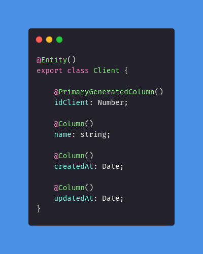

# Padrões de Projeto GoFs Estruturais Adotados no Projeto

## 1. Introdução

As interações entre os objetos de um sistema podem gerar fortes dependências entre as classes e as relações entre elas. Essas dependências aumentam a complexidade das eventuais alterações no funcionamento do sistema e prejudicam a manutenibilidade e a escalabilidade do sistema e como consequência disso, o custo da manutenção e do projeto aumentam. Os padrões de projeto estruturais procuram diminuir o acoplamento entre os objetos de um sistema orientado a objetos. Portanto, esses padrões alteram a estrutura, principalmente, no nível de classes.

Nesse documento serão abordados os padrões de projeto Gofs Estruturais que visam a resolução do problema acima citado e que serão utilizados no projeto.

## 2. Princípios e Padrões

### 2.1. Facade

Oculta toda a complexidade de uma ou mais classes através de uma Facade (Fachada). A intenção desse Padrão de Projeto é simplificar uma interface, biblioteca ou conjunto complexo de classes. Uma fachada é uma classe que fornece uma interface simples para um subsistema complexo que contém muitas partes que se movem. Ela pode fornecer funcionalidades limitadas em comparação com trabalhar com os subsistemas diretamente.

**Justificativa**: Será utilizado no contexto da nossa aplicação, porque iremos trabalhar com diversas bibliotecas que basicamente atuam como Facade, ou seja, que "escondem" sua implementação para resolução de um problema complexo.

### 2.2. Decorator

O decorator permite uma melhor adaptação do objeto, ou seja, ele permite adicionar uma funcionalidade ou um comportamento de forma dinâmica colocando os objetos dentro de um envoltório (wrapper) de outros objetos que contém os comportamentos.

**Justificativa**: Será utilizado no contexto da nossa aplicação, porque iremos trabalhar com Decorator que o próprio Node.js dá suporte e também os componentes do React.

No código abaixo, temos um exemplo da criação da model Client, utilizando os decorators do orm.
Obs: Não é um trecho do nosso código mas encaixa no contexto da nossa aplicação

<figcaption>Figura 1. Exemplo do padrão GoFs de Decorator</figcaption>

### 2.3. Proxy

O proxy funciona como uma barreira permitindo controlar o acesso ao objeto original funcionando como se fosse um interceptador. Como por exemplo, caso tenhamos endpoint na nossa api que não podem ser acessados por qualquer um, podemos implementar um proxy que faça validação de ip, User agent ou até mesmo de token. É um padrão de projeto que nos permite maior segurança e controle a determinados serviços.

**Justificativa**: Será utilizado no contexto da nossa aplicação, porque iremos trabalhar com middleware, como por exemplo, na verificação de token.

No código abaixo, temos um exemplo da utilização de middlewares funcionando como um proxy de autenticação no node.
Obs: Não é um trecho do nosso código mas encaixa no contexto da nossa aplicação

<figcaption>Figura 2. Exemplo do padrão GoFs de Proxy</figcaption>

## 3. Referências Bibliográficas

> - SERRANO, Milene. Módulo Padrões de Projeto GoF(s) Estruturais - Material em Slides.
> - REFACTORING GURU, Padrões Estruturais. Disponível em <https://refactoring.guru/pt-br/design-patterns/structural-patterns>. Acesso em 29 de agosto de 2021.

## Histórico de Revisões

| Data       | Versão | Descrição                          | Autor(es)                                    |
| :--------- | :----- | :--------------------------------- | :------------------------------------------- |
| 29/08/2021 | 0.1    | Adicionando introdução             | [Abner Filipe](https://github.com/abner423)  |
| 29/08/2021 | 1.0    | Adiciona Tópicos                   | [Ítalo Alves](https://github.com/alvesitalo) |
| 30/08/2021 | 2.0    | Adiciona Tópicos Decorator e Proxy | [Abner Filipe](https://github.com/abner423)  |
| 05/09/2021 | 2.1    | Destaca e revisa as justificativas | [Ítalo Alves](https://github.com/alvesitalo) |
| 05/09/2021 | 2.2    | Revisão do documento               | [Sergio Cipriano](https://github.com/sergiosacj), [Emily Dias](https://github.com/emysdias) |
| 20/09/2021 | 3.0    | Adição de imagens e revisão do documento | [Lucas Boaventura](https://github.com/lboaventura25) |
